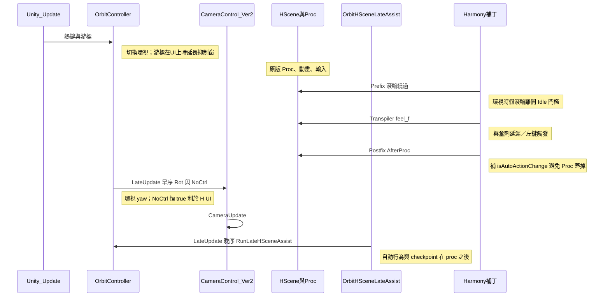

# HS2OrbitAndExciter：行為與架構整理

本文件整理插件**實際程式行為**（含與註解／說明不符處）、**依啟動頻率分類**，供重構與對照 Cursor 計畫使用。實作以程式碼為準。

---

## 1. 環視相位：並沒有「鏡頭倒轉環視」

`OrbitController.LateUpdate` 使用 `_orbitPhase` 與 `_orbitAccumulatedDegrees`：

- **Phase 0**：`accum` 由 0 增至 360。
- **Phase 1**：`accum` 由 360 減回 0；減到 0 時呼叫 `OnOrbitCycleComplete`，並切回 phase 0。

但套用到 **實際 yaw** 的公式是：

```text
rotY = start + (phase==0 ? accum : 360 - accum)
```

因此在 **兩個 phase** 中，`rotY` 對時間的變化都是 **同一旋轉方向**（`accum` 在 phase 1 遞減時，`360-accum` 遞增）：

- Phase 0：`rotY` 從 `start` 到 `start+360`（模 360 為一整圈）。
- Phase 1：`rotY` 同樣從 `start` 到 `start+360` 再掃一次。

**結論**：內部在「倒著減 `accum`」，**畫面上沒有「倒回」繞場**；一個完整 cycle（phase0→phase1→觸發 `OnOrbitCycleComplete`）等於 **連續兩次同向各 360°**（時間上約 **2×`OrbitTimePer360`**，預設單向 10s 時約 20s 觸發一次 cycle 完成）。

若 CHANGELOG／設定說明寫「先正轉再倒回」，與上列數學**不一致**，應視為文件待修正。

---

## 2. 「一圈」觸發的副作用（`OnOrbitCycleComplete`）

以下行為在 **上述 cycle 完成時**（phase 1 末 `accum` 歸零）評估，節奏為 **秒級～十秒級**（由 `OrbitTimePer360` 決定）：

| 設定 | 行為 |
|------|------|
| `OrbitCountBeforeRandom` | 每 N 次 cycle 完成：隨機身體焦點與起始水平角 |
| `ClothesChangeEnabled` | 每 cycle 推進脫衣序列一步 |
| `ChangePoseOnCycle` + `OrbitCountBeforePoseChange` | 滿足圈數時 `ChangeAnimation` 換姿（循環副作用可被 `ShouldSuppressAutoAction` 擋下） |

---

## 3. 依啟動頻率／語意分類（架構對照）

### 3.1 `OrbitAutoActionEnabled` 為何容易混亂

同一開關同時影響：

1. **每幀晚序** [`ApplyOrbitAutoAction`](OrbitController.cs)（內含「無列表 ≥1.5s」遲滯才真正設旗標，但函式仍每幀進入）。
2. **每次 `ProcBase.Proc` 結束** [`OrbitAutoActionAfterProcPatches`](Patches/OrbitAutoActionAfterProcPatches.cs)：在 `ShouldSuppressAutoAction` 為 false 時幾乎 **每 Proc** 把 `isAutoActionChange`、`initiative` 補回。

後者頻率與 H 場景 **Proc** 同步，遠高於「幾秒協助一次」的直覺，易與姿勢 UI、原版流程互搶。

### 3.2 分類表

**（1）以環視 cycle 為單位（約 2×`OrbitTimePer360`）**  
見第 2 節：隨機焦點／換裝／可選換姿。

**（2）條件觸發（應有狀態／遲滯；平常不應無差別狂跑）**

| 行為 | 條件摘要 |
|------|-----------|
| 滾輪繞過 | 環視開、`wheel==0`、Animator 在 Idle 對齊六態、`OrbitBypassWheelState.DelaySeconds`（2s）後注入假滾輪 |
| Checkpoint | `OrbitCheckpointTimeoutSeconds>0`、非 action loop、無 `selectAnimationListInfo`（反射）、通過 suppress、閒置滿 timeout；工作區另有 invoke cooldown |
| ApplyOrbitAutoAction（晚序） | 開關 on、通過 suppress、連續無列表 ≥1.5s 才設旗標 |
| AccumulateFeelWhenOrbit | 僅 `IsInActionLoopState`、非準備倒數 |
| 準備倒數 | `IsInPreparationState` 進場 → 3s 後 `speed=1` |
| 環視剛開 grace | `ShouldSuppressAutoAction` 內 2.5s |

**（3）明確按鍵／操作**

| 操作 | 作用 |
|------|------|
| Ctrl+Shift+O | 切換環視 |
| Ctrl+Shift+P | 設定視窗 |
| Q/W/E（Shift 第二女角） | 焦點；`inputForcus` 時跳過 |
| 滿條 + 左鍵 | 興奮劑立即觸發路徑 |
| UI 上左鍵 | `MarkManualUiClick` → 約 3s 抑制自動協助 |

**（4）高頻（每幀／每 Proc）**

| 行為 | 說明 |
|------|------|
| 環視相機 | 每幀寫 `Rot`、`NoCtrlCondition` |
| `RunLateHSceneAssist` | 環視開時每幀晚序評估 |
| `OrbitAutoActionAfterProcPatches` | 每 Proc Postfix — **與「秒級協助」語意錯頻** |
| FeelHitPatches / Exciter Transpiler | 隨命中與對應 Proc 路徑觸發 |

**重構方向（原則）**：改 `HSceneFlagCtrl` 意義的邏輯應收斂到 **（2）或（1）的排程**，避免與 **（4）每 Proc** 綁在同一個 `OrbitAutoActionEnabled`。

---

## 4. 執行時掛載與執行順序

- **GameObject** `DontDestroyOnLoad`：`OrbitController`（order **-100**）、`OrbitHSceneLateAssist`（**32000**）、`OrbitSettingsGUI`。
- **早序**：相機 yaw、`NoCtrlOrbit`。
- **晚序**：`RunLateHSceneAssist` → `ApplyOrbitAutoAction`、`TryAutoAdvancePastCheckpoint`（在 H proc 之後，與相機數學分離）。
- **Harmony**：見 `HS2OrbitAndExciter.Awake` 內 `PatchSafe` 列表（FeelHit、Exciter Transpiler、OrbitBypass 滾輪、`OrbitAutoActionAfterProcPatches`）。

### 單幀時間線（概念）



---

## 5. 設定項與程式對照（精簡）

| 設定鍵 | 主要影響 |
|--------|-----------|
| `OrbitTimePer360` | 單次 360° 掃描所需秒數；**一個 cycle 完成約 2×** |
| `OrbitCountBeforeRandom` | 每 N 次 **cycle 完成** 隨機焦點／角度 |
| `OrbitCountBeforePoseChange` / `ChangePoseOnCycle` | 依 cycle 換姿 |
| `ClothesChangeEnabled` | 每 cycle 換裝序列 |
| `OrbitAutoActionEnabled` | 晚序遲滯 + **AfterProc 每 Proc 補旗標** |
| `OrbitCheckpointTimeoutSeconds` | 反射 `GetAutoAnimation`；0＝關閉 |
| `FeelAddPerSecondWhenOrbit` | 僅 action loop 內累加 |
| `ExcitementTriggerDelaySeconds` | Transpiler 滿條邏輯 |
| `OverrideFaintness` | `isFaintness` + 可請求重套用視角 |

---

## 6. 相關檔案

| 檔案 | 角色 |
|------|------|
| [OrbitController.cs](OrbitController.cs) | 環視相機、cycle、焦點、興奮累加、晚序協助入口 |
| [OrbitHSceneLateAssist.cs](OrbitHSceneLateAssist.cs) | 晚序呼叫 `RunLateHSceneAssist` |
| [OrbitHelpers.cs](OrbitHelpers.cs) | chaFemales、焦點骨、換裝、姿勢列表 |
| [OrbitSettingsGUI.cs](OrbitSettingsGUI.cs) | Ctrl+Shift+P 設定 |
| [Patches/OrbitAutoActionAfterProcPatches.cs](Patches/OrbitAutoActionAfterProcPatches.cs) | 每 Proc 補 auto 旗標 |
| [Patches/OrbitBypassWheelPatches.cs](Patches/OrbitBypassWheelPatches.cs) | 滾輪繞過 Prefix |
| [OrbitBypassAnimatorGate.cs](OrbitBypassAnimatorGate.cs) | 滾輪繞過 Animator 閘門 |
| [Patches/ExciterTriggerPatches.cs](Patches/ExciterTriggerPatches.cs) | 興奮劑 Transpiler + `ExciterState` |
| [Patches/FeelHitPatches.cs](Patches/FeelHitPatches.cs) | `FeelHit.isHit` |
| [HS2OrbitAndExciter.cs](HS2OrbitAndExciter.cs) | BepInEx 入口、Config、Harmony 註冊 |
| [CHANGELOG.md](CHANGELOG.md) | 歷史行為；**與本文件衝突時以程式為準** |
| [HScene_Idle_States.md](HScene_Idle_States.md) | 原版 Idle 狀態對照 |

---

## 7. 與 git `HEAD` 的差異說明

工作區若尚未 commit，[`TryAutoAdvancePastCheckpoint`](OrbitController.cs) 可能較 `HEAD` 多出：**`IsInActionLoopState` 閘門**、**invoke 後 cooldown**、有列表時清 cooldown 等。細節以 `git diff HEAD -- OrbitController.cs` 為準。
