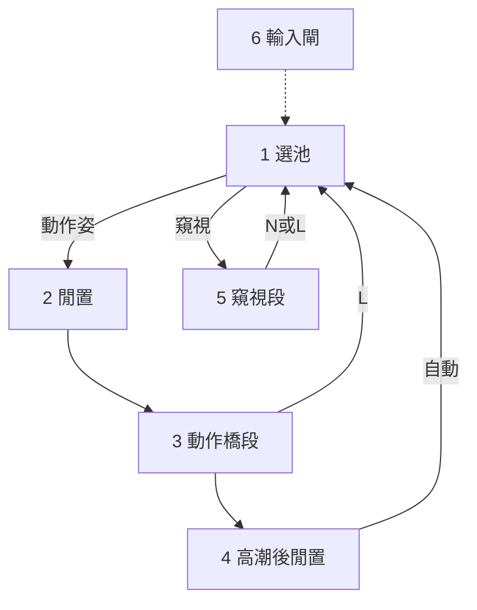

# H 流程：狀態重定義排序清單

## 產品目標

> **幾乎不介入，也能享受整場體驗；不卡死。**

## 方法論轉變（為何要重定義）

| 過去（要丟掉） | 現在（要建立） |
|----------------|----------------|
| **時間驅動**：到處等 2 秒／5 秒再推進 | **狀態驅動**：進格做合約、滿足條件就走出口 |
| 多路並行換段（假滾輪、關卡逾時、迴轉、自動換姿） | **單一換段擁有者＝選池** |
| 邏輯散落、跨狀態互搶 | **一格一出口擁有者**；正交只掛事件 |
| 為手感加延遲造成競態 | 遊戲會做的跟遊戲；只補「不介入會永久停住」的洞 |

**規則**：下列每一項重定義時，只談「進場條件／本格職責／自動出口／手動／禁止」。不定「等幾秒再怎樣」當主邏輯（原版模態／讀檔耗時除外）。

---

## 溝通方式（已定）

- 繁體中文；不自創縮詞。
- 一次可問多題，但**每一題必須講清楚**：
  1. **在說什麼狀況**（用你實際會碰到的畫面／按鍵）
  2. **選項 A／B 差在哪**（各會發生什麼）
  3. **我建議選哪個、為什麼**
  4. **請你回覆什麼**（例如「第 2 題選 A」）
- 禁止只丢一行抽象問題表。
- **過程 vs 邏輯**：只調節奏、不改 FSM 切換的，標成「過程」。會改出口／切換／擁有者的，必須先警告「這會改邏輯」，預設禁止，等你同意。

## 0. 總則（已定稿）

### 八點定案

```text
第 1 點：Ctrl+Shift+O 未啟動＝與本外掛無關、保持乾淨。
不跑流程自動推進，也不受理外掛熱鍵。

第 2 點：與原版「女方主導／第 8 顆／自動挑姿」隔離；換段只認選池。
禁止外掛寫 initiative／isAutoActionChange／呼叫 GetAutoAnimation 當換段。

第 3 點：時間規則＝方案 B。
禁止用「等 N 秒」當「換下一個姿勢」或「高潮後又回到同一個姿勢循環」的理由。
讀檔、遊戲淡入淡出、對話框可以等。
若實測證明不碰滾輪就永遠高不了潮，才允許在同一個姿勢裡面加最小補洞（盡量用感度條件，少用純計時）。

第 4 點：進 H 第一姿＝方案 A。
不要再抽一次姿勢。直接當「閒置」：對話旗＋自動開幹。
等這一段高潮結束、離開高潮後閒置後，才第一次進「選池」。

第 5 點：自慰＝動作線（方案 A）。
有閒置／開幹／循環／高潮；純播出只留窺視。
允許無插入：閒置→循環。
必須拆掉舊債：場所自慰 id 不得再當「長欣賞不開幹」與窺視綁在一起。

第 6 點：零介入不含自動換角、不含自動換衣。
換角（G）、換套裝（H）、亂數穿著（J）僅手動。
流程（開幹／高潮／換姿／窺視）可自動。

第 7 點：高潮後安靜不得以時間擋住「高潮後閒置→選池」。
當初安靜是為語音／特效能播完；能乾淨就不擋換段。
語音／特效若需節奏，用事件掛接，不用「等 2 秒才准換段」。

第 8 點：當前狀態權威＝方案 A。
以第一女動畫狀態名稱為主，再加上「這個姿勢是不是窺視」。
不以外掛自訂計時器當權威。

第 9 點（過程 vs 邏輯）：
  調整「過程節奏」（例如閒置落地後約 1 秒再開幹）＝不新增狀態、不改出口擁有者、不改狀態圖切換。
  凡會改變 FSM 切換／出口／誰擁有換段的提案：必須先明確警告使用者，預設禁止，未經同意不得寫進契約或實作。
```

### 契約六欄（定稿）

```text
名稱：總則（全流程共用規則）

進場條件：
  進入 H 場景，且已按 Ctrl+Shift+O。
  未開＝外掛完全不介入。

本格職責（全域）：
  1. 狀態驅動；不以「過了幾秒」當換段／開幹主因。
  2. 一格一出口擁有者。
  3. 換段只認選池；與原版女方主導／自動挑姿隔離。
  4. 同姿內跟遊戲；只補不介入會卡死的洞。
  5. 正交掛事件；不寫下一姿、不開幹、不結束場景。
  6. 開協助後流程可零介入走完；換角／換衣僅手動。
  7. 按鍵當幀有回饋；原版模態／載入／讀檔可短拒或拖住。
  8. 狀態圖拓樸凍結。
  9. 自慰＝動作線；窺視＝唯一下純播出。
  10. 狀態偵測以動畫狀態名＋是否窺視為準。
  11. 過程節奏可調；FSM 切換／出口邏輯不可默默改——要改必先警告，預設禁止。

自動出口：各流程格至少一條不介入也能離開的出口。
  **例外（已核可）**：窺視段採 A-NL——現階段不實作「播完→選池」；
  零介入看完可能撞原版確認窗，屬已知可接受行為；主出口仍為 N／L。

手動：跳出＝全域逃生。L＝選池。換角僅手動。
  **例外（已核可）**：§15 換衣／脫衣可自動綁環視圈（內建預設），與「H／J 手動」並存。

禁止：
  - 等 N 秒當換段或高潮後回同姿循環。
  - 外掛寫 initiative／isAutoActionChange／GetAutoAnimation 換段。
  - 高潮後安靜用時間擋選池。
  - 自動換角（本階段）。自動換衣僅限 §15 綁環視圈，禁止另開第二套換衣邏輯。
  - 跨狀態寫出口；正交推進流程；等語音再換姿；同姿連高潮；順便改圖。
  - 未經警告與同意，改變狀態圖切換或出口擁有者。

現況落差（實作必拆）：
  - 推 initiative／isAutoActionChange；checkpoint GetAutoAnimation；AfterProc 補旗標。
  - 高潮後閒置同姿回循環；尚無選池。
  - 長欣賞名單綁自慰＋窺視；高潮安靜擋協助。
  - TryForceStartSex 直跳循環跳過插入。
```

總則完成。下一項：**1. 選池**（六欄契約）。

交接檔（新開對話可讀）：[`HS2OrbitAndExciter/HANDOFF_fsm_state_redefine.md`](d:/HS4/HS2OrbitAndExciter/HANDOFF_fsm_state_redefine.md)

---

## 1. 選池（已定稿）

### 拍板結果

```text
選池題 A＝A1：混池（動作線＋窺視）
選池題 B＝B1：優先未用過；用完清空再抽（仍排除當前）
選池題 C＝C1：換角後不清本場已用姿勢
選池題 D＝D2：可抽清單為空時，放寬過濾再試一次（至少放寬「本場去重」）；仍空則失敗打日誌、留在原處
```

### 契約六欄（定稿）

```text
名稱：選池（換段唯一入口）

進場條件：
  已開 Ctrl+Shift+O，且：
  - 自動：離開高潮後閒置之後
  - 自動：窺視段播完之後
  - 手動：L（使用者版選池）
  - 手動：窺視中 N（語意＝進選池；與第 6c 對齊）
  不進場：剛進 H 第一姿；換角／換衣／相機等正交

本格職責（當幀事件）：
  1. 從當前可用姿勢混池抽下一姿（含窺視；自慰算動作線）。
  2. 必排除當前姿 id；優先本場未用過；耗盡則清空已用再抽（仍排除當前）。
  3. 若過濾後為空：放寬本場去重再抽一次；仍空→失敗日誌、不換姿、留在原狀態。
  4. 當幀分支：動作線→閒置；窺視→窺視段 In（不經閒置）。
  5. 成功則記入本場已用；換角不清已用。
  6. 只決定「下一姿是誰／進哪條線」；不開幹、不加感。

自動出口：抽中後當幀離開 → 閒置或窺視段。不停留、不等 N 秒。

手動：L＝再觸發同一選池。

禁止：
  - GetAutoAnimation／initiative／isAutoActionChange 當選池。
  - 閒置裡再選姿；選池裡開幹／假滾輪換段。
  - 用舊長欣賞 id 名單把自慰當窺視。

現況落差：無選池 API；多路換段；PickNextPose 無去重／無分支；高潮後未呼叫選池。
```

### 窺視判定（實作備註）

```text
以「會進原版 Peeping 流程」為準（ActionCtrl／Proc 種類），
不要用舊 LongAppreciationPoseIds 把場所自慰混成窺視。
```

選池完成。下一項：**2. 閒置**。

---

## 2. 閒置（已定稿）

### 拍板結果

```text
閒置題 A＝A1：觸發原版「可以開始」（IsStart／等價），讓 StartProc 走 Insert 或 WLoop
閒置題 B＝B1：設對話旗後不跨幀等語音；照樣推進開幹
閒置題 C＝落地後約 1 秒再開幹（過程節奏；不改 FSM）
閒置附問＝C附1：N＝取消 1 秒排程並立刻開幹（與自動共用同一開幹函式）
```

### 契約六欄（定稿）

```text
名稱：閒置（動作線起點；只開幹）

進場條件：
  - 選池抽到動作線，換姿完成且動畫為 Idle／D_Idle（含自慰）
  - 剛進 H 第一姿已是動作線閒置
  不進場：窺視

本格職責：
  1. 設對話／開場語音旗；不等語音播完。
  2. 換姿落地後約 1 秒（觀眾／開場準備），再自動開幹。
  3. 開幹手法＝觸發原版開始條件，讓 StartProc：能插→Insert（播完原版進循環）；不能插→循環。
  4. 禁止永久停在閒置；禁止在此選姿。

自動出口：
  開幹成功 → 動作橋段（插入中或循環）。
  開場約 1 秒餘裕後觸發；其後跟原版 Insert／循環，不再另加固定秒數鏈。

手動：
  N＝加速開幹（可忽略或縮短該 1 秒餘裕——見下方備註）。
  L＝選池。

禁止：
  - 閒置內選池；直跳 WLoop 跳過該有的 Insert。
  - 用等秒數當換段；把「1 秒準備」複製到高潮後／選池等處。
  - 窺視走本合約。

現況落差：
  - TryForceStartSex 直跳 WLoop。
  - 約 2 秒強制 IsStart／A+B 當欣賞不開幹（自慰舊債）。
```

### 待你補一句（可選）

**閒置題 C 附問：按 N 時，那約 1 秒還要不要等？** → **已定 C附1**

```text
C附1：N＝立刻開幹（取消尚未到的 1 秒準備）。
理由（程式乾淨）：開幹只留一個函式；
  自動＝落地後排程約 1 秒再呼叫；
  N＝取消排程並立刻呼叫同一函式。
C附2 會讓 N 在這 1 秒內幾乎沒用，或又多分支出「N 也要等」。
這是過程節奏，不改 FSM：閒置 → 動作橋段 不變。
```

閒置全部定稿（含 C附1）。

---

## 3. 動作橋段（討論中・部分已回）

橋段題 C＝已定（過程・感度速率；不改 FSM 出口）：
  - 感度上升要有「最小值」（保證會推進，不會卡死）。
  - 同一循環階段（同一種 Loop／同一段動作）最多約 10 秒就要能往下一階段或往高潮推進。
  - 總預算隨階段數：
      三種 Loop＋高潮前衝刺（例如 W＋S＋O＋衝刺）→ 感度路徑最多約 40 秒跑完並進得了高潮。
      只有一種 Loop → 最多約 20 秒。
  - 出口仍是：高潮播 → 高潮後閒置 →（之後）選池。
  - 仍不做同姿連高潮。
  - 「限時」指的是感度推進預算，不是用選池逃出循環。
```

### FSM vs 過程 vs 畫面

```text
FSM：閒置 → 動作橋段 → 高潮後閒置；L → 選池
畫面悶：環視等正交；沒層級可切時再加「速度變化」
聽覺變化：語音（不等語音再推進流程）
流程不卡死：感度最小值＋分階段時間預算（C）
禁止：自動選池解悶或解語音單一
```

---

### 語音（說清楚）

WLoop 重播時語音若也單一，體感更悶。約定：

- **做**：在循環／命中／高潮等事件上讓語音有變化（含語音巡禮這類）。  
- **不做**：等某句語音播完才換段／開幹／進高潮。  
- **不做**：為了換一句語音去自動選池換姿。

---

### 橋段題 C：感度時間預算（已定・寫清楚）

先前「不是限時內必高潮」**作廢／修正**為下面這套（你剛定的）：

```text
目的：感度一定要往上走，同一階段不要乾等超過約 10 秒。

階段＝同一姿裡可區分的循環段（例：WLoop、SLoop、OLoop／高潮前衝刺）。
每階段預算 ≈ 10 秒（感度要夠推進到下一階段或觸發高潮）。

總預算例子（你舉的）：
  - 三 Loop＋高潮前衝刺 → 最多約 40 秒跑完感度並進得了高潮
  - 僅一種 Loop → 最多約 20 秒

實作含義（過程）：
  - 依「當前姿有幾個循環階段」設定感度／速度最小值，使預算內能走完。
  - 實測仍卡 → 再加強感度或最小觸發（仍進高潮動畫，不選池逃出）。

仍禁止：
  - 同姿連高潮
  - 用自動選池當「超時解悶」
  - 把 10 秒變成新的 FSM 節點
```

**這是過程節奏，FSM 仍是：動作橋段 → 高潮後閒置。**

---

### 契約六欄（定稿）

```text
名稱：動作橋段

進場：閒置開幹成功後

職責：
  - 插入不插手（A1）
  - 同姿內可推層級 W/S/O（B姿1）；沒層級則靠速度＋環視＋語音
  - 語音可變化；不等語音再換段
  - 感度有最小值；每循環階段約 ≤10 秒推進；總預算随階段數（約 20～40 秒例）
  - N＝加速（D1）；畫面主趣味＝環視等正交
  - **Finish 執行（族 B／C）**：`IsFinishVisible` + `ctrlFlag.click` 交原版 Proc 消費；
    挑選用 `OrbitFinishPathLedger`（歷史比例最低），**不**用 BHS Prefer。
    詳見 `docs/h_loop_flow_by_family.md` §6.3～§6.3.2。

自動出口：→ 高潮後閒置（FSM）；經 Proc 正常高潮鏈，非外掛 setPlay 直跳。

手動：L＝選池；N＝加速

禁止：
  - 自動選池解悶／解超時
  - 等語音再換段
  - 同姿連高潮
  - 把分階段秒數變成新狀態節點
  - 以外掛 `setPlay` 直跳 `Orgasm_*` 當常規高潮出口（應收斂 `TickOLoopToOrgasmRecovery`）
  - 與 BHS Autofinish 並存（內建 FinishDirector 後移除依賴）

現況落差：FeelAdd 速率未依階段數編預算；直跳 WLoop 跳過 Insert 屬閒置債；
  Finish 仍走 setPlay 強推，未實作 IsFinishVisible + click + Ledger。
```

動作橋段定稿。下一項：**4. 高潮後閒置**。

---

## 4. 高潮後閒置（已定稿）

### 選池是背景換段事件

```text
選池＝換段時的短暫事件（當幀抽下一姿並分支），不是常駐畫面、也不是使用者選單。
自動／手動都呼叫同一個選池；不是新的可見狀態格。
```

### 定稿

```text
高潮後題 A＝A1：一進高潮後閒置就準備／呼叫選池（自動換段；選池當背景事件）。
高潮後題 B＝B1：一般 Orgasm_*_A 類 → 約 0.5～1 秒短收尾餘裕再選池
  （過程節奏；出問題再微調；不當語音閘。B3 等語音完＝否決）。
高潮後題 C＝C1：L 與 N 都＝立刻選池（可取消尚未結束的 B1 短餘裕）。
  **手動 vs 自動（審查補定）**：自動路徑＝特殊收尾（Drink_A／Vomit_A 等）**播完**才選池、不被 B1 砍斷；
  手動 N／L＝**允許立刻砍斷**進選池（使用者意志優先）。
高潮後題 D＝D1（細化）：喝／吐等特殊收尾有明確狀態定義
  （原版 AfterIdle 名單內 Drink_A／Vomit_A 等，含進場鏈 Drink→Drink_A）
  → **自動：播完就跑選池**。出口仍是選池；禁止回同姿循環；不另開例外路徑。
```

### 本格欄位

```text
進場：動作橋段高潮動畫結束 → 進入 AfterIdle 類狀態名。
職責：收尾待機／特殊收尾播完；唯一自動出口＝選池。
自動出口：
  - 一般 Orgasm_*_A 等：B1 短餘裕 → 選池
  - Drink_A／Vomit_A 等特殊收尾：該收尾鏈／狀態播完 → 選池
手動：L／N → 立刻選池
禁止：同姿回 WLoop；用語音播完當閘；第二套換段
現況落差：AfterIdle≈2s 後假滾輪回同姿循環 → 改呼叫選池；特殊收尾不得被 B1 砍斷
```

高潮後閒置定稿。下一項：**5. 窺視段**。

---

## 5. 窺視段（已定稿）

### 已鎖拓樸

```text
選池抽中窺視 → In…→Out_Loop；主出口＝N／L → 選池
純播出；禁開幹；不經閒置。
```

### 定稿

```text
窺視題 A＝A-NL：使用者幾乎都會用 N／L 離場，不大可能看完。
  「播完自動選池／改原版確認窗」現階段不為它動程式（低優先／可不做）。
  主出口寫死為 N／L；若極少數看完撞到原版窗，之後再補洞也不改拓樸。
窺視題 B＝B1：N 與 L 都＝立刻離場進選池。
窺視題 C＝C1：禁開幹／禁當動作橋段；只播片（正交可掛）。
窺視題 D＝D1：不實作「再看一次」；要再看等之後再抽到。
```

### 本格欄位

```text
進場：選池抽中窺視 → 進原版 Peeping In（不經閒置）
職責：純播出
自動出口：現階段不實作「播完→選池」專用邏輯（見 A-NL）
手動出口：N／L → 立刻選池（主路徑）
禁止：開幹；當動作橋段；為「再看一次」另開出口
現況落差：長欣賞綁自慰＋窺視 → 拆掉；窺視離場改呼叫選池
```

窺視段定稿。下一項：**6. 輸入閘／跳出／L·N**。

---

## 6. 輸入閘／跳出／手動鍵意（已定稿）

### 定稿

```text
輸入閘題 A＝A1：最小閘＝淡入出、換姿／載入中、手動忙碌、原版模態對話。
  不擋：高潮中、窺視播片中。（否決「完全不擋」與「高潮總擋」。）
跳出題 B＝B1：沿用原版左下角結束＝全域逃生；不畫進狀態圖、不經選池。
鍵意題 C＝C-姿：
  G＝換女角（正交，不改姿意圖）
  L＝換姿＝手動觸發選池
  N＝該格的「往前推」（以各格表為準）：
    閒置＝立刻開幹；橋段＝加速；高潮後／窺視＝立刻選池
```

### 各格 L／N（與 2～5 已定契約對齊；本表優先於任何一句話總結）

| 所在格 | L | N |
|--------|---|---|
| 閒置 | 選池 | 取消約1秒準備，立刻開幹 |
| 動作橋段 | 選池 | 加速（不換段、不開幹） |
| 高潮後閒置 | 立刻選池 | 立刻選池（此格無開幹） |
| 窺視段 | 立刻選池 | 立刻選池（此格無開幹） |

```text
現況落差：CanAcceptHotkey 用 nowOrgasm 總擋 → 改 A1；
L／N／G 語意與上表對齊；拆掉把 L 當換角的誤解。
```

第 6 項定稿。下一項：**7～10 舊債收斂**。

---

## 7～10. 舊債收斂（已定稿）

**總背景**  
換段只認選池；橋段進度靠直接加 FEEL；旁路換段／假滾輪／圈數換姿一律收掉。

### 定稿

```text
舊債題 A＝A-還輪：停用全部假滾輪注入；真實滾輪還給原版預設；不預留窄口假滾輪。
舊債題 B＝甲1乙1：
  甲1＝協助下不推 isAutoActionChange／不走 GetAutoAnimation 換段；換段只認選池。
  乙1＝關掉外掛逾時／關卡到點換姿；若仍要到點換段只能呼叫選池。
舊債題 C＝C-脫鉤：環視轉圈只做相機；不觸發換姿；關閉「圈數到了換姿勢」。
舊債題 D＝D1：拆第二套出口（PoseLandedPolicy／逃生門閂當換段）；
  落地只辨認進哪一格，出口交給已定的 2／4／5；刪長欣賞綁自慰／窺視與重複計時。
```

### 現況落差（實作備註）

```text
- OrbitBypassWheel*／TryInjectOrbitWheelBypass → 刪或永久關閉
- TryPushOrbitAutoActionAssist／AfterProc 補旗標／GetAutoAnimation 換段 → 拆除
- OrbitCountBeforePoseChange → 關閉（環視與換姿脫鉤）
- OrbitPoseLandedPolicy 的 Appreciate／TimedEscape→同姿／重複計時 → 改交 2／4／5
```

7～10 定稿。下一項：**11 起正交副作用**（不改狀態圖）。

---

## 11～23. 正交副作用（定稿中）

**總原則**

```text
正交不改狀態圖出口；不第二套換段；不等語音再換姿。
數值／鏡頭細部＝過程，可後調。
```

---

### 11. 環視相機 — 已定稿（含視角／軌道）

**核心用途**：長時間 LOOP 時讓畫面有變化（不是拿來換段／加 FEEL）。

**已定**  
- 熱鍵：只多一個「停止環視」鍵。  
- **禁止**：換段、開幹、加 FEEL、圈數換姿。  
- 太近：距離下限已有（`OrbitDistanceMultMin≈1.35`）→ 問題 2 視為已解決。

**現況算法（一句）**  
Look-at＝骨點或姿預設相機；距離＝身高×倍率；每幀只改 **yaw** 往返 360°；亂數換焦 80% 走 `setCameraLoad`，起始角只有 0/45/90/135/180。

---

#### 問題 1：切換後看不到人

**可能原因（依程式）**  
- 骨焦點 `GetFocusPosition` 失敗時**靜默不更新** TargetPos，yaw 仍在轉 → 看向空處／舊點。  
- 80% 用姿**預設相機**後，每幀仍覆蓋 yaw，預設鏡頭與環視軌道錯位。  
- 換姿／換焦後未強制重算「人在畫面內」。

**解法選項**  
- **1A（建議）**：切換後一律「骨焦點優先」重綁（頭／胸／骨盆），失敗則回退上一有效焦點；**不要**靜默跳過。姿預設相機改為可選少數比例，或只在停止環視時用。  
- **1B**：切換後做一次「成幀檢查」（目標投影是否在畫面中心帶）；失敗就拉回胸焦點＋安全距離。  
- **1C**：降低／關閉 `PreferGameDefaultCameraChance`（現 0.8），環視期間幾乎只用骨焦點。

---

#### 問題 2：切換後太近 — 已解決

維持距離下限；細部倍率仍可後調。

---

#### 問題 3／欣賞原則 — 已定方向（依你回覆）

**欣賞定義（鎖）**  
環視欣賞＝**以女角身體軸向為基礎**，目的是**看到不同身體部位**（不是繞世界水平空轉、也不是為了換段）。

**含義**  
- 軌道座標系貼齊女角軀幹軸（頭−骨盆）與面向，不硬綁世界地平當唯一參考。  
- 焦點在身體部位間切換（既有頭／胸／骨盆；可再細）＋繞該焦點、沿身體軸向的運動 → 同一 LOOP 內畫面部位有變化。  
- 地平角／俯仰用來「看得到部位」，不是亂甩。  
- 遮擋＝優先原版穿牆透明；能貫徹則不做自製障礙換角。

**第一版建議實作契約（待你點頭）**

```text
環視3＝
  1. 每幀／換焦：從女角算軀幹軸＋面向，建立「身體空間」軌道。
  2. 焦點循環或 timeout／手動 QWE：頭↔胸↔骨盆（看不同部位）。
  3. 繞當前焦點轉：方位相對身體軸；距離維持安全下限；小幅俯仰對準部位。
  4. 【相對角・已定】每次旋轉（每圈／每段軌道切換）都改變
     「相機相對女主身體軸向」的相對角：
     - 改變量＝亂數，**最小 60 度**（|Δ| ≥ 60°；過程可微調上限，例如 <180 避免幾乎原地）。
     - 改變量**非整數度**（帶小數），避免固定角檔切換。
     - 舊 AnglePresets 整數表（0/45/90…）退役。
  5. 【遮擋・改訂】射線／相機穿牆＝好事（視線通）。
     原版已有 ConfigVanish（圖像 Shield／遮擋透明）：相機碰到地圖 vanish 清單內物件→變透明。
     沙發常沒作用＝物件沒進該圖清單／碰撞名不對，不是「不該穿」。
     **優先**：貫徹／補強這套透明；**能貫徹就不做障礙距離上限／因障換角**。
     自製 Linecast 擋距離＝僅透明做不到時的後備，預設不做。
  5b. 【提前運算】切角前空檔算「下一圈相對角＋zoom」；軸變則作廢重算。
     （不再為障礙重試而預先算。）
  6. 【距離／Zoom】**每圈** zoom in 或 out；近距≥胸／骨盆尺度；遠端行程拉大；
     穿牆靠透明看人，不因障礙砍遠距。
  7. 停止環視鍵：停轉，保留當前看部位與距離。
```

#### 環視補丁定稿（1～8＋遮擋改訂＋你確認 OK）

```text
【已確認 OK】
- 切焦／切角後強制用骨頭當看點（1A）；失敗回退上一有效焦點。
- 躺／身體近水平：繞那條身體軸轉（相對世界翻上翻下看部位＝預期）。
- 圈轉很快、下一角／zoom 沒算完：不卡遊戲，延用現角，下圈再算。
- 換衣繼續綁環視圈、內建預設、少設定。
- 【已確認 OK】停止環視只停相機；協助／FSM／FEEL 照常；換衣因綁圈暫停。
  （協助 active ≠ 環視轉動中，須拆兩狀態。）

【其餘已定・一併有效】
1. 一圈＝360°；下一圈相對角亂數 |Δ|≥60°、非整數。
2. 身體軸變 → 預算作廢重算。
3. 遮擋＝優先原版穿牆透明；能貫徹則不做障礙換角。
5. 拆圈數換姿、環視加 FEEL。
8. 預設跟主女；QWE 到第二女則暫時跟該女。
每圈 zoom；近≥胸/骨盆；遠行程拉大；停止鍵。
```

環視（11）**定稿完成**。

---

### 12／13／14 — 已定（不大改）

```text
12 換視角 Q／W／E、K＝維持現況；禁止順便換姿。
13 換女角 G＝僅手動；不自動；換完重綁。
14 換套裝 H＝僅手動；不自動。
```

---

### 15. 穿著／脫衣 — 已定（續綁環視、少設定）

**你的決定（更新）**：換衣服／脫衣**繼續自動綁在環視圈上**，內建預設節奏，避免使用者調一堆設定。  
（不為了多看衣服去催人猛轉；推進跟圈走即可。）

```text
15＝手動 J 仍可；自動換衣／脫衣綁環視圈＋內建預設；禁止順便換姿；少暴露設定項。
```

---

### 16／17／18. 刺青／胸／乳頭噴 — 已定（擴大觸發）

**你的決定**：只要**進高潮**就發生，範圍含：  
- 女方高潮  
- **口交等男方射精**  
- **女女愛**高潮  

（不僅限現況只 hook `AddOrgasm` 女高潮計數。）

```text
16／17／18＝高潮事件觸發（含男射／女女／女高潮）；可設定關；
手動：T／⇧T、B 等維持。
禁止：擋選池、推進流程。
現況落差：OrgasmEffectsPatch 僅 AddOrgasm → 擴成「進高潮」統一事件（含 Houshi 男射、女女等）。
```

---

### 19. 內射腹脹／反懷孕縮腹 — 已定

```text
19＝
  脹：內射計數增加 → 肚子升一級（大幅拉高上限；過程數字實作定）。
  縮（反懷孕）：愛撫、女女 視為懷孕的相反 → 肚子降一級。
    觸發（定稿）：選池／換姿落地進入「愛撫」(ActionCtrl.Item1==0)
      或「女女」(Item1==4) 時降一級（與內射「事件升一級」對稱成對）。
    手動：R 清腹；Y／U 微調（若 Preg+ 在）。
  偵測／脹縮不綁死語音巡禮。
  禁止：擋選池、推進流程。
```

（若落地就縮太密，可再改成「該類高潮才縮」——屬過程微調，先警告再改。）

---

### 20. 語音巡禮 — 已定

```text
20＝設定開則自動依高潮／階段換語音；換角重綁。
禁止：等語音再換姿／選池。
```

---

### 21. FEEL／命中 — 已定

```text
21＝協助開＋動作橋段內自動加 FEEL（不綁環視是否在轉）；命中／滿條輔助可留。
禁止：順便換段。
```

---

### 22. 強制脫力 — 已定

**原版次數**：`gotoFaintnessCount` 預設＝3 → 契約改 **6**。  
**強制脫力設定**：保留（可手動開／關寫 `isFaintness`）。  
**WeakStop**：遊戲設定「弱體化停止」開著時原版永不脫力。

```text
22＝
  1. 保留設定「強制脫力」。
  2. **22-甲**：協助（Ctrl+Shift+O）開著時 → 忽略 WeakStop（次數到 6 必可進脫力）。
  3. 次數門檻＝**6**（反射寫 readonly 或進 H 覆寫一次）。
  4. 不當流程第二出口；D_* 姿由狀態名權威辨認。
```

（審查更正：resist／Libido 不是脫力閘，勿再拆那組。）

### 停止環視 vs 協助（已定）

```text
停止環視＝只停相機軌道；協助／FSM／FEEL 照常；換衣因綁圈暫停。
協助 active ≠ 環視轉動中（實作拆兩狀態）。
```

### 狀態名→格（已定）

```text
閒置：Idle／D_Idle
橋段：Insert／WLoop／SLoop／OLoop／D_* 循環；WIdle／SIdle（不回閒置）
高潮後：IsAfterIdle 名單（含 Drink_A／Vomit_A）
窺視：ActionCtrl→Peeping；不看 LongAppreciationPoseIds
```

---

### 23. 面板／設定／日誌 — 已定

```text
23＝HUD／設定窗維持手動開。
日誌：清掉不用的；留下「必要、能看出有沒有卡住」的流程日誌
  （例如：進哪一格、選池進出、換姿落地、開幹、高潮→選池、熱鍵拒因）。
不當狀態圖出口。
```

---

### 尚待你回（精簡）

```text
契約重定義已全部定稿（含 22-甲）。
回「實作／execute」後再改程式。
交接：HS2OrbitAndExciter/HANDOFF_fsm_contract_review.md
```

## 狀態圖（拓樸鎖死，僅供對照）



---

## 逐項重定義排序（流程本體 → 正交）

我們**一樣樣**重定義。建議嚴格依序；前一項契約未定，不開下一项實作。

### A. 流程本體（必須先理順）

| 序號 | 狀態／步驟 | 一句話職責 | 重定義時要寫死的欄位 | 狀態 |
|------|------------|------------|----------------------|------|
| **0** | **總則** | 狀態驅動、禁止時間驅動換段、禁止跨格寫出口 | 擁有者規則；何謂「卡死」；跟遊戲／補洞準則 | **已定** |
| **1** | **選池** | 抽下一姿；當幀分支到閒置或窺視 | 混池；去重；空池放寬；動作→閒置／窺視→In | **已定** |
| **2** | **閒置** | 對話旗＋約1秒準備＋原版開幹；N立刻開幹 | A1／B1／1秒過程／C附1 | **已定** |
| **3a～3c** | **動作橋段** | 插入不插手；層級／速度／語音；感度分階段≤10s | A1／B姿1／C預算／D1 | **已定** |
| **4** | **高潮後閒置** | 離開→選池；禁同姿回循環 | A1／B1／C1／D（特殊收尾播完→選池） | **已定** |
| **5** | **窺視段** | 純播出；主出口 N／L→選池 | A-NL／B1／C1／D1 | **已定** |
| **6a** | **輸入閘** | 最小閘：淡入出／換姿中／忙碌／模態 | A1 | **已定** |
| **6b** | **跳出** | 沿用左下角原版結束 | B1 | **已定** |
| **6c** | **手動熱鍵語意** | G換角；L選池；N開幹（視格見§6表） | C-姿 | **已定** |

### B. 收斂舊債（流程對齊後立刻做，仍屬流程）

| 序號 | 項目 | 要定的結論 | 狀態 |
|------|------|------------|------|
| **7** | **假滾輪** | 停用；滾輪還給原版預設 | A-還輪 | **已定** |
| **8** | **自動換姿旁路** | 不推原版自動挑姿；關外掛逾時換姿 | 甲1乙1 | **已定** |
| **9** | **依迴轉換姿勢** | 環視與換姿脫鉤；圈數不換姿 | C-脫鉤 | **已定** |
| **10** | **姿勢落地政策／逃生門閂** | 拆第二套出口；併入 2／4／5 | D1 | **已定** |

### C. 正交副作用（流程契約定完再掛；不改狀態圖）

| 序號 | 項目 | 掛哪個事件 | 禁止 | 狀態 |
|------|------|------------|------|------|
| **11** | **環視相機** | 主女軸向；360一圈；角≥60°；穿牆透明優先；1A；每圈zoom | 換段／FEEL／圈數換姿 | **已定** |
| **12** | **換視角** | 維持現況 | 順便換姿 | **已定** |
| **13** | **換女角（G）** | 僅手動 | 自動／當選池 | **已定** |
| **14** | **換套裝（H）** | 僅手動 | 自動 | **已定** |
| **15** | **穿著／脫衣** | 續綁環視圈；內建預設；少設定 | 順便換姿 | **已定** |
| **16** | **刺青** | 進高潮就觸發（含男射／女女） | 擋選池 | **已定** |
| **17** | **胸圍變大** | 同上 | 擋選池 | **已定** |
| **18** | **乳頭噴** | 同上 | 擋選池 | **已定** |
| **19** | **腹脹／縮腹** | 內射脹；愛撫／女女落地縮；拉高上限 | 擋選池 | **已定** |
| **20** | **語音巡禮** | 自動換階；禁等語音換姿 | 等語音再換姿 | **已定** |
| **21** | **感度／FEEL** | 橋段自動；不綁環視 | 順便換段 | **已定** |
| **22** | **強制脫力** | 強制設定保留；次數6；協助忽略 WeakStop（甲） | 不當第二出口 | **已定** |
| **23** | **面板／日誌** | 清無用 log；留卡死診斷 | 不進狀態圖 | **已定** |

### D. 本階段明確不做

| 項目 | 原因 |
|------|------|
| 獨立泌乳 | 未做；另開項 |
| 雙女第二人換角 | 本階段不管 |
| 同姿自動連高潮 | 本階段不做 |
| 跨幀等語音再換姿 | 否決 |
| 每格固定延遲當主邏輯 | 否決（舊時間驅動） |

---

## 每一項的契約模板（重定義時填）

討論第 N 項時，只填這六欄，填完才算定稿：

```text
名稱：
進場條件：（什麼情況進入／觸發）
本格職責：（只做這些）
自動出口：（不介入時怎麼離開；條件式，非「等 N 秒」）
手動：（可選熱鍵；幾秒內要有回饋）
禁止：（跨狀態／時間驅動／第二套換段等）
現況落差：（現行程式哪裡違背）
```

---

## 建議討論起點

從 **0. 總則** 開始（方法論），接著 **1. 選池**（樞紐），再 **2. 閒置**……嚴格順序。

請回覆：是否同意這份排序？若同意，下一則訊息我們開始填 **0. 總則** 的六欄契約。
