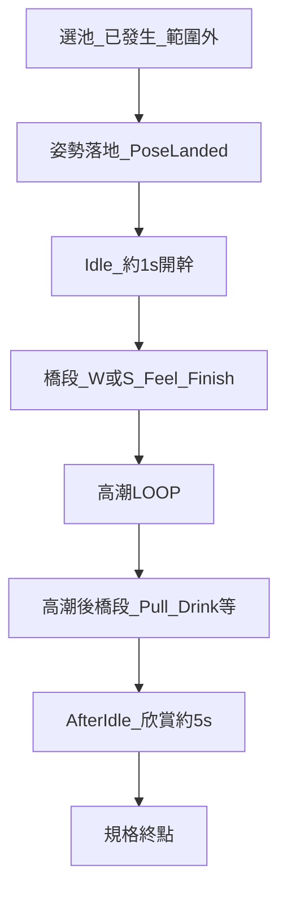
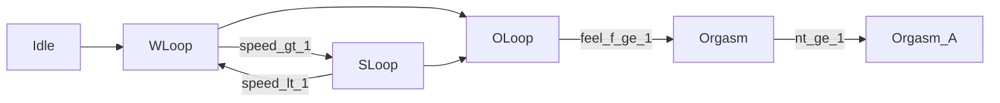
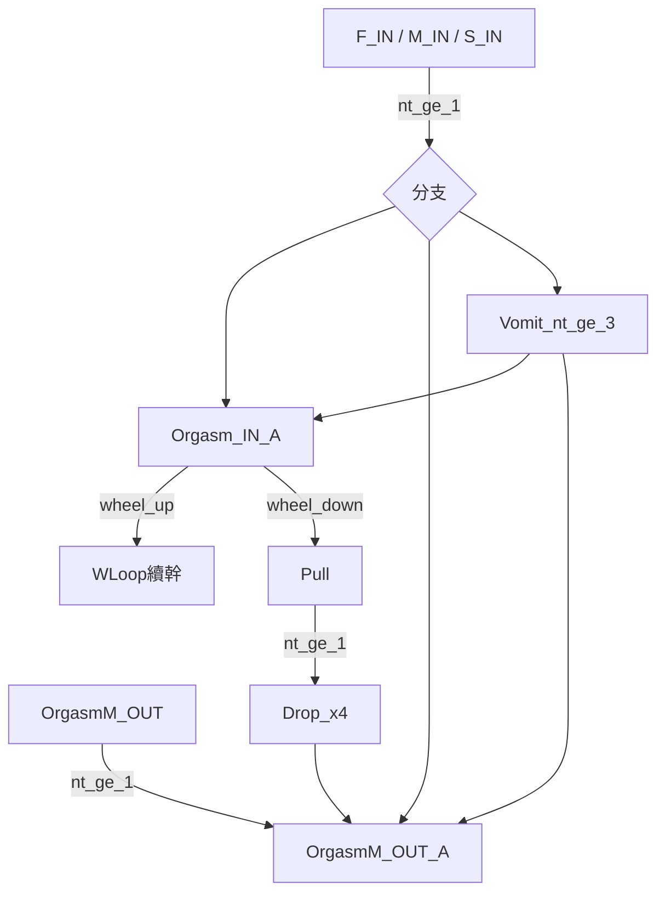
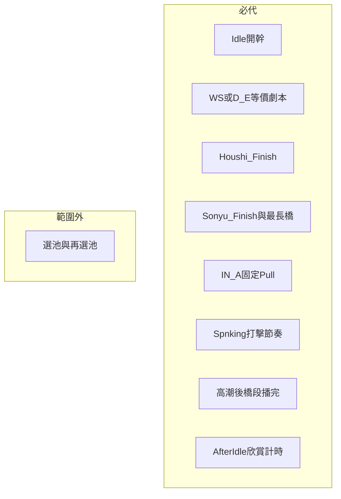

# H 場景 LOOP／高潮流程（依 Proc 族群）

> 原版行為對照文件，供 Orbit「單次選池落地後」全代操實作使用。
> 資料來源：`dll_decompiled/` 內 `Sonyu.cs`、`Aibu.cs`、`Houshi.cs`、`Masturbation.cs`、`Les.cs`、`Spnking.cs`、`HScene.IsAfterIdle`。
> **不含**窺視（Peeping）主流程；**不含**選池／混池邏輯。

---

## 0. 審查結論：這是不是最佳方向？

**結論：是，目前最佳方向是「外層 Orbit 管策略，內層 H Proc 管出口」。**

也就是：

- Orbit 負責：選池落地後的 session 劇本、W/S 節奏、Finish path 選擇、歷史比例帳本、何時代操。
- 原版 Proc 負責：真正進入高潮、清 gauge、`nowOrgasm`、`numInside`／`numOutSide`、voice、Obi、後續橋段。
- 執行方式優先走 `ctrlFlag.click = ClickKind.*`，讓 `Sonyu`／`Houshi`／`MultiPlay_*` 的 `LoopProc`／`OLoopProc` 消費；**不要**把 `setPlay("Orgasm...")` 當常規出口。

這比目前 `TickOLoopToOrgasmRecovery` 直跳高潮更好，原因是：

1. **副作用完整**：原版 Proc 會同步處理 `AddTaiiParam`、`AddFinishResistTaii`、`voice.SetFinish`、`numInside`、`numOutSide`、`isInsert`、`isGaugeHit`、`nowOrgasm` 等。外掛手寫很容易漏。
2. **姿勢合法**：`HSceneSprite.IsFinishVisible(slot)` 來自原版 `SetFinishSelect` 產出的 `lstFinishVisible`；mod 姿勢可用同一套表，不需要 Orbit 維護平行清單。
3. **流程可觀測**：消費 click 後自然進 `Orgasm_*`／`*_A`，`OrbitFsmCell` 仍可用 Animator state 收斂到 AfterIdle。
4. **與 BHS 的正確關係**：BetterHScenes 可當參考，尤其是「Auto finish」這類功能需求；但 Orbit 不應直接照搬 BHS 的全域偏好／Random 策略。

### 0.1 對 BetterHScenes 的評估

本機安裝：`D:\HS2\BepInEx\plugins\2155X\HS2_BetterHScenes.dll`，版本 2.6.5。
設定檔：`D:\HS2\BepInEx\config\HS2_BetterHScenes.cfg`。
公開原始碼已抓到：`D:\HS4\third_party\BetterHScenes`，GitHub：`https://github.com/Mantas-2155X/BetterHScenes`。目前 `v2.6.5` tag 與 `HEAD` 為 `818647e8f5b9e916652898c45c1c7434dd174a64`。

設定檔可確認 BHS 有：

- `Auto finish = Both`
- `Preferred auto service finish = Random`
- `Preferred auto insert finish = Random`
- `Always hit gauge heart = Always`
- `Apply saved offsets = true`
- `Enable Animation Fixer = true`
- `Fix broken Animation Tables = true`
- `Fix broken Effectors = false`
- `Fix Kiss Animations = true`

這說明 BHS 的方向是「自動補足 H 場景體感與 finish」，但 Orbit 的產品目標不同：

| 項目 | BetterHScenes | Orbit 應採 |
|------|---------------|------------|
| Finish 執行 | 可參考：`Update` 中達門檻後設 `hFlagCtrl.click`，交回原版 Proc | **採用**：`IsFinishVisible`／可見性條件 + `ctrlFlag.click` |
| 可見性映射 | 可參考：BHS v2.6.5 已處理 HS2 service／insert 的特殊 slot | **採用但封裝**：集中在 `OrbitFinishDirector` 映射函式，並用 trace 驗證 |
| Finish 策略 | 使用者 Prefer／Random | **不採用**：改歷史比例最低 |
| 觸發門檻 | Service `feel_m >= 0.98`；Insert `feel_f >= 0.98 && feel_m >= 0.98` | **不照搬**：跟原版 Proc 門檻與 Orbit 劇本節奏 |
| 作用範圍 | 全域 QoL | **不採用**：只在 Ctrl+Shift+O 協助開、ActionBridge 內 |
| Gauge 命中 | 可 Always hit | **部分採用**：Orbit 自己控 FEEL／speed 預算 |
| 姿勢 offset／IK fixer | BHS 強項：saved offsets、Animation Fixer、broken Animation Tables、kiss correction、effectors | **採用**：作為 H session 品質層；短期相容／偵測 BHS，中期再決定是否移植最小子集 |

若 BHS Auto finish 同時開著，會與 `OrbitFinishDirector` 競爭 `ctrlFlag.click`。內建 FinishDirector 落地後，建議使用者關閉 BHS Auto finish，或 Orbit 偵測到 BHS 後提示「Auto finish 可能衝突」。

BHS 的姿勢 offset／IK solver 與 AutoFinish 要分開看：

- **採用**：`HSceneOffset.ApplyCharacterOffsets()`、`FixMotionList(fileFemale)`、solver 依賴順序、last frame solution、kiss offset、joint correction、必要時 `FixEffectors()`。
- **先不複製**：BHS 的 UI、offset XML 編輯流程、Animation UI 切 motion；短期以已安裝 BHS 作相容層。
- **Orbit 要做**：偵測 BHS 是否存在、讀 config 狀態、在 trace 裡記錄 `bhsOffsetApplied`／`bhsFixMotionList`／`bhsAutoFinishEnabled`，避免 FinishDirector 與 BHS AutoFinish 打架。
- **實作邊界**：solver/offset 可改善姿勢品質，但不可成為第二套換姿或高潮出口。

### 0.2 原版證據鏈（實作時必核對）

原版 `HSceneFlagCtrl.ClickKind`：

| enum | 值 |
|------|----|
| `FinishBefore` | 0 |
| `FinishInSide` | 1 |
| `FinishOutSide` | 2 |
| `FinishSame` | 3 |
| `FinishDrink` | 4 |
| `FinishVomit` | 5 |
| `RecoverFaintness` | 6 |
| `Spnking` | 7 |

原版 `HSceneSprite` Finish UI active index 對照：

| UI active index | 呼叫 | 設定的 click |
|-----------------|------|--------------|
| 1 | `OnClickFinishOutSide()` | `FinishOutSide` |
| 2 | `OnClickFinishInSide()` | `FinishInSide` |
| 3 | `OnClickFinishDrink()` | `FinishDrink` |
| 4 | `OnClickFinishVomit()` | `FinishVomit` |
| 5 | `OnClickFinishSame()` | `FinishSame` |

注意：這張表只描述 UI active index 與按鈕行為，**不能直接拿來解釋 `IsFinishVisible(n)` 的語意**。HS2 的 `SetFinishSelect` 會依模式、`modeCtrl`、姿勢條件建立 `lstFinishVisible`；`IsFinishVisible(n)` 是結構可見性 token，不等於 UI 按鈕順序，也不等於 `ClickKind` enum 數字。

BHS v2.6.5 的 AutoFinish 可作為 HS2 實用映射參考：

| 族 | pathId | BHS／HS2 可見性條件 | 設定的 click |
|----|--------|---------------------|--------------|
| B 侍奉 | `drink` | `IsFinishVisible(1) && modeCtrl != 0 && !(!IsFinishVisible(4) && IsFinishVisible(1) && modeCtrl == 1)` | `FinishDrink` |
| B | `vomit` | `IsFinishVisible(3)` | `FinishVomit` |
| B | `outSide` | `IsFinishVisible(4) || (IsFinishVisible(1) && (modeCtrl == 0 || modeCtrl == 1))` | `FinishOutSide` |
| C 插入 | `maleInside` | `IsFinishVisible(1)` | `FinishInSide` |
| C | `same` | `IsFinishVisible(2)` | `FinishSame` |
| C | `maleOutside` | `IsFinishVisible(5)` | `FinishOutSide` |

**實作權威：**

- 可見性：`HSceneSprite.SetFinishSelect(...)` / `IsFinishVisible(slot)`
- 消費條件：各 Proc 的 `LoopProc` / `OLoopProc`
- UI 點擊等價：設定 `ctrlFlag.click = HSceneFlagCtrl.ClickKind.*`
- 參考實作：`third_party/BetterHScenes/HS2_BetterHScenes/HS2_BetterHScenes.cs` 與 `Tools.cs`

注意：`IsFinishVisible(slot)` 是「這個姿勢結構上支援該 finish」，不等於「本幀按鈕 active」。仍需同時滿足 Proc 條件，例如 `feel_m >= 0.75`、`canInside`、69 姿勢外射限制、`FinishSame` 的女側感度等。

### 0.3 昨晚事故紀錄的讀法

昨晚的大量 log／MD／probe 要當作 **事故現場與補救過程**，不能直接升格成穩定規格。

- git 正式 commit 最新主要停在 `2026-07-13`，`2026-07-15` 這批多為未提交的 probe、log、MD、診斷 patch。
- `tools/_fsm_hang_latest.txt` 這類檔案有價值，但用途是還原「哪裡卡住」，不是證明臨時補洞就是正解。
- `PROJECT_STATUS_20260715_h_loop_and_storyboard.md` 是交接索引；真正規格以本文件的 H-loop／BHS／全姿態回補結論為準。

目前已確認的事故類型：

| 類型 | 症狀 | 文檔結論 |
|------|------|----------|
| `setPlay` 直跳高潮 | 流程看似前進，但 Proc 副作用不完整 | 降級為最後保險；常規改 `click` 交 Proc |
| `NowChangeAnim`／`selectAnimationListInfo` 黏住 | 選姿看似排隊但沒有落地 | 保留 pose invariant 與 kick trace |
| OLoop 卡住 | 灌 FEEL 但不設合法 Finish | B/C 族必做 `IsFinishVisible` + `click` |
| 全姿態回歸不足 | 選池只拿目前表，舊的條件放寬沒跟上 | 恢復 `HS2UnlockAllPoses` 的安全放寬策略 |

### 0.4 全姿態開放：必須恢復

以前已做過獨立外掛：`D:\HS4\.claude\worktrees\flamboyant-bhaskara\HS2UnlockAllPoses`。核心 patch 是 `HSceneSprite.CheckMotionLimit`、`CheckMotionLimitRecover`、`CheckAutoMotionLimit` 的 Postfix。

舊策略不是無條件硬開所有姿勢，而是：

| 類別 | 策略 |
|------|------|
| 可放寬 | state、achievement、pain、faintness 等會把姿勢藏起來的安全條件 |
| 不放寬 | 人數、`EventNo==19` 特例、`CheckEventLimit`、`CheckPlace`、`CheckAppendEV`、事件窺視匹配 |

因此新的 Orbit 方向：

1. 恢復為 `OrbitPoseUnlockPolicy` 或重新併入 `HS2OrbitAndExciter` 的 patch。
2. 保留舊 `WouldUnsafeChecksPass(...)` 思路：只放寬安全條件，不破壞場景/事件/人數硬限制。
3. `OrbitPosePool` 仍負責「抽哪個」，但候選池應建立在全姿態開放後的可見性上。
4. trace 必記 `posePool.total`、`posePool.afterUnlock`、`posePool.afterFaintness`、`CheckMotionLimit` 結果，避免又以為「表裡有」等於「可以落地」。

## 1. 名詞與範圍

### 1.1 姿勢 vs 族群

- **姿勢**：`AnimationListInfo` 一筆（`nameAnimation` 僅供顯示）。
- **族群**：同一 `lstProc` 模式（Aibu／Houshi／Sonyu／Masturbation／Les／Spnking）共用同一套 Animator state 名與 Proc 分支。
- MultiPlay（`mode` 7／8）依 `modeCtrl` 分流到 Aibu（0）／Houshi（1|2）／Sonyu（3|4）子鏈，**不另開族**。

### 1.2 本文件服務的「單次 session」

**起點**：選池已發生，`ChangeAnimation` 落地（`PoseLanded`）。
**終點**：`AfterIdle` 欣賞秒數結束（`OrbitFsmFlow.TickAfterIdleToPool` **之前**）。
**不含**：`OrbitPosePool`、`RequestSelectPool`、高潮後自動再選池、進場抽姿。



### 1.3 虛脫鏡像

多數 state 有 `D_*` 對應（自慰無 `D_*`）。下文若只寫正常名，實際另有 `D_WLoop`、`D_Orgasm_A` 等平行鏈。

### 1.4 高潮／橋段「跑幾圈」

原版用 **`normalizedTime >= N`**（Animator 一輪 = 1），不是固定秒數。

| 狀態／片段 | 典型 N |
|------------|--------|
| 多數 Orgasm／IN／OUT | 1 |
| Sonyu `Drop` | 4 |
| Sonyu／部分 `Vomit` | 3 |
| `Insert` → `WLoop` | `nt >= 1` |

---

## 2. 共通規則（族 A／B／C）

### 2.1 滾輪與 W↔S

在 `LoopProc` 內（Sonyu／Aibu／Houshi／Les）：

```text
speed += wheel
speed > 1 且在 WLoop → setPlay(SLoop)
speed < 1 且在 SLoop → setPlay(WLoop)
feel_* >= 0.75 或 FinishBefore → OLoop
```

女側感度：`feel_f`；奉仕男側：`feel_m`（OLoop 進場門檻）。

### 2.2 Idle 離場

`StartProcTrigger`：`wheel == 0` 則 **不進** WLoop／Insert（手動必擋）。
Orbit 現況：`OrbitFsmFlow.ShouldForceVanillaIsStart` + IsStart patch 代開幹。

### 2.3 AfterIdle 判定（`HScene.IsAfterIdle`）

`Orgasm_A`、`Orgasm_IN_A`、`Orgasm_OUT_A`、`Drink_A`、`Vomit_A`、`OrgasmM_OUT_A` 及對應 `D_*`。

---

## 3. 五族流程（合併重複）

### 3.1 族 A — 女側簡鏈（Aibu ≡ Les；MP modeCtrl=0）

**適用**：愛撫、女女。

```text
Idle --wheel--> WLoop ↔ SLoop
  --feel_f≥0.75 或 FinishBefore--> OLoop
OLoop --feel_f≥1--> Orgasm (nt≥1)
  --> GotoFaintness? --> Orgasm_A | D_Orgasm_A
```

| 階段 | Animator 狀態 | 圈數 |
|------|---------------|------|
| 加速 | WLoop ↔ SLoop | 滾輪控 speed |
| 高潮前 | OLoop | — |
| 高潮 | Orgasm / D_Orgasm | 1 |
| AfterIdle | Orgasm_A / D_Orgasm_A | 待機 |

**無**男 Finish 表；女滿條自動高潮。



---

### 3.2 族 B — 奉仕（Houshi；MP modeCtrl=1|2）

```text
Idle --wheel--> WLoop ↔ SLoop
  --feel_m≥0.75 或 FinishBefore--> OLoop
OLoop -->
  FinishOutSide  → Orgasm_OUT (1) → Orgasm_OUT_A
  FinishDrink    → Orgasm_IN (1) → Drink_IN → Drink → Drink_A
  FinishVomit    → Orgasm_IN (1) → Vomit_IN → Vomit → Vomit_A
```

| 階段 | 路徑 | 圈數 |
|------|------|------|
| 高潮 | Orgasm_OUT / Orgasm_IN | 1 |
| 橋段 | Drink_IN→Drink / Vomit_IN→Vomit | 各段 nt≥1；Vomit 鏈可 3 |
| AfterIdle | *_A | 待機 |

**無**女 `feel_f≥1` 自動射；OLoop **必須** `click` Finish（或外掛代）。

---

### 3.3 族 C — 插入（Sonyu；MP modeCtrl=3|4）

**進場**

| 條件 | 鏈 |
|------|-----|
| `canInside` | Idle → Insert (nt≥1) → WLoop |
| 否（含部分 69） | Idle → WLoop |

**加速／高潮前（WLoop 內也可 Finish，可跳過 O）**

```text
WLoop ↔ SLoop
  feel_f≥0.75 或 FinishBefore → OLoop
  FinishInSide  (feel_m≥0.75 + canInside) → OrgasmM_IN
  FinishOutSide (feel_m≥0.75)             → OrgasmM_OUT
```

**OLoop 高潮出口**

> 規格注意：`FinishSame` / `OrgasmS_IN` 是「同時高潮」路徑，**不能**視為已覆蓋男側單獨高潮。Sonyu 男側至少要獨立覆蓋 `OrgasmM_IN`（內射）與 `OrgasmM_OUT`（外射）；同時高潮只是第三種 Finish 變體。

| 觸發 | 狀態 | 圈數 |
|------|------|------|
| feel_f≥1 | OrgasmF_IN | 1 |
| FinishInSide | OrgasmM_IN | 1 |
| FinishOutSide | OrgasmM_OUT | 1 |
| FinishSame | OrgasmS_IN | 1 |

**高潮後橋段**



| 橋段 | 說明 | 典型圈數 |
|------|------|----------|
| Orgasm_IN_A | 內射後待機；滾輪上分岐 | 待機 |
| Pull → Drop | 拔出＋滴落 | Pull 1；Drop 4 |
| OrgasmM_OUT_A | 外射後待機 | 1 |

---

### 3.4 族 D — 自慰（Masturbation）

**不靠滾輪 W↔S**，靠 **feel 門檻升檔**：

```text
Idle → WLoop
  feel≥0.25 → MLoop
  feel≥0.5  → SLoop
  feel≥0.75 或 FinishBefore → OLoop
OLoop --feel_f≥1--> Orgasm (可能等語音) → Orgasm_A
```

| 階段 | 狀態 | 備註 |
|------|------|------|
| 加速 | W → M → S | feel 門檻 |
| 高潮 | Orgasm | nt≥1 |
| AfterIdle | Orgasm_A | 無 D_* |

---

### 3.5 族 E — 打屁股（Spnking）

**無 WLoop／SLoop／OLoop**。

```text
WIdle --wheel打--> WAction (nt≥1)
  feel<0.5 → WIdle
  feel≥0.5 → SIdle ↔ SAction
Action 結束且 feel_f≥1 → Orgasm (1)
  → WIdle 或 脫力 → D_Orgasm_A
D_Orgasm_A ↔ D_Action → D_Orgasm
```

---

## 4. 對照總表

| 族 | H mode | Idle→首動作 | 加速 LOOP | 高潮前 | 高潮（圈數） | 橋段／AfterIdle |
|----|--------|-------------|-----------|--------|--------------|-----------------|
| A | Aibu／Les／MP·0 | WLoop | W↔S | OLoop | Orgasm×1 | Orgasm_A |
| B | Houshi／MP·1\|2 | WLoop | W↔S | OLoop | OUT／IN→Drink／Vomit×1 | OUT_A／Drink_A／Vomit_A |
| C | Sonyu／MP·3\|4 | Insert?→W | W↔S | O±Finish | F/M/S_IN、M_OUT×1；Drop×4；Vomit×3 | IN_A／OUT_A／Pull／Drop |
| D | Masturbation | WLoop | W→M→S | OLoop | Orgasm×1 | Orgasm_A |
| E | Spnking | WIdle | Idle↔Action | （無 O） | Orgasm×1 | D_Orgasm_A 等 |

---

## 5. 使用者介入點（手動 `initiative==0`）

### 5.1 分級

| 級 | 意義 |
|----|------|
| **必擋** | 不操作則停住或缺功能 |
| **可選** | 不操作仍可往下，但少 W／S、早進 O 等 |
| **無手動** | 滿條／nt 自動推進 |

### 5.2 全族（session 內）

| 節點 | 原版輸入 | 級 | 單次 session 代操規格 |
|------|----------|----|------------------------|
| Idle 開幹 | 滾輪≠0 | 必擋 | `IsStart` patch（已有） |
| W↔S | 滾輪改 speed | **產品必代** | 控 speed 曲線；見 §6 |
| FinishBefore | click | 可選 | 可不點，靠 feel 進 O |
| 換姿 | 選單／選池 | **範圍外** | 假設已選池 |
| RecoverFaintness | click | 情境 | 可選 |

### 5.3 各族要點

**族 A**：OLoop→Orgasm 無 Finish；Orgasm_A 再開需滾輪（session 終點在欣賞，通常不再開）。

**族 B**：OLoop→高潮 **必** Finish（Out／Drink／Vomit）；只灌 FEEL 會卡 O。

**族 C**：

- 女高潮：`feel_f≥1` 自動。
- 男射：Finish In／Out／Same（feel_m 門檻）。其中 In／Out 是男側單獨高潮；Same 是同時高潮，**不得**用 Same 取代 In／Out 的覆蓋。
- `Orgasm_IN_A`：全代操**固定**下滾輪 → Pull→Drop（**不代續幹**）。

**族 D**：升檔靠 feel；Orgasm 可能等語音。

**族 E**：每次「打」需滾輪；高潮無 Finish 表。

---

## 6. 產品規格：單次 session 全代操

### 6.1 原則

1. **不要手感、要功能**：可灌 `feel_f`／`feel_m`；推進走 **`ctrlFlag.click`、控 `speed`、讓 Proc 跑**；**禁止**以外掛 `setPlay` 直跳高潮表當常規出口（現 `TickOLoopToOrgasmRecovery` 應收斂刪除）。
2. **執行層借 BHS、策略層歸 Orbit**（見 §6.3.1～§6.3.2）：
   - **借**：`HSceneSprite.IsFinishVisible` 過濾姿勢合法性 → 設 `HSceneFlagCtrl.ClickKind` → 交給原版 `LoopProc`／`OLoopProc` 消費。
   - **不借**：BHS 固定 Prefer／Random、每幀無門控 `Update`、插入 Finish 要雙方滿條（0.98）等挑選與時機。
   - **歸 Orbit**：歷史比例帳本挑路徑、僅協助開、綁 FSM 動作橋段、後續橋段代操（IN_A Pull 等）。
3. **不併存 BHS Autofinish**：內建 `OrbitFinishDirector` 後不再依賴 `HS2_BetterHScenes` 的 Auto finish。
4. **不碰選池**：本規格只管落地→AfterIdle。

### 6.2 橋段 W／S 劇本

一次落地內，進 O／Finish **前** 跑完弱、強各一段（預設各 **T≈4s**）：

| sessionIndex 奇偶 | 順序 |
|-------------------|------|
| 偶數（0,2,…） | WLoop（speed 0.3～0.9）→ SLoop（speed>1） |
| 奇數（1,3,…） | SLoop 先 → WLoop |

跨 session 才交替；**同一次選池**只跑其中一種劇本。

族 D 等價：W→M→S 順播，或先拉到 S 再降檔。
族 E 等價：本 session 以 WAction 或 SAction 為主導輪。

### 6.3 Finish 挑選（族 B／C）— 歷史比例最低

**挑選**（Orbit 獨有）與 **執行**（`IsFinishVisible` + `click`，見 §6.3.1）分兩層，不可混為一談。

```text
available = 族內候選 ∩ IsFinishVisible(slot)（及 modeCtrl／canInside 等原版條件）
ratio(path) = count[path] / max(1, total)
pick = argmin(ratio among available)
同分 → 較長橋段優先
設 ctrlFlag.click = 對應 ClickKind（由 Proc 本幀或下幀消費；外掛不得再 setPlay 搶戲）
出路確認後：count[path]++（跨 session 累計，OrbitFinishPathLedger）
```

候選必須分兩層過濾：

1. **結構可見**：`HSceneSprite.IsFinishVisible(slot)`。
2. **Proc 可消費**：本幀條件滿足，例如 `feel_m>=0.75`、`canInside`、非禁用 69 外射、Same 所需女側條件等。

只過第一層不可直接設 click；只看第二層也不安全，會硬點當前姿勢不支援的結局。

### 6.3.1 執行契約：`IsFinishVisible` + `ctrlFlag.click`

**為何用這層（相對 `setPlay` 強推）**

| 好處 | 說明 |
|------|------|
| 走原版唯一正規出口 | `Sonyu`／`Houshi`／`MultiPlay_*` 的 `LoopProc`／`OLoopProc` 讀 `click` 後自行 `setPlay`、清 gauge、`nowOrgasm`、後續橋段 |
| 副作用完整 | `AddTaiiParam`、`voice.SetFinish`、`numInside`／`numOutSide`、`AddOrgasm`、Obi、`isInsert` 等由 Proc 一次做完；外掛不必複製 |
| 姿勢合法 | `IsFinishVisible(n)`＝當前姿 `lstFinishVisible` 含該 Finish 槽；避免不支援內射的姿被硬點 In |
| FSM 可辨識 | 消費後自然進 `Orgasm_*` → `*_A`；`OrbitFsmCell` 用動畫名進 **高潮後閒置**，不需猜 setPlay 結果 |
| 少維護 | 新姿勢／mod 只改 visible 表；外掛不維護平行 `OrgasmAnimName` 表 |

**實作步驟（`OrbitFinishDirector`）**

```text
門控：Ctrl+Shift+O 協助開 且 FSM＝動作橋段 且 非 nowChangeAnim
觸發：feel／mode 達原版 Proc 門檻（例：Finish 路徑 feel_m≥0.75；非 BHS 的 0.98）
1. 依當前族（B／C）與 modeCtrl 列出候選 pathId → ClickKind → 可見性條件
2. available = 候選 ∩ visible ∩ Proc 可接受（canInside、69 体位等由 Proc 再驗；挑選時先過 visible）
3. pick = OrbitFinishPathLedger.argmin(available)
4. 若 pick 非空：ctrlFlag.click = pick 的 ClickKind（同一幀最多設一次；設後不 setPlay）
5. 等 Proc 消費；以動畫進入 Orgasm_*／*_A 為成功；再 count[path]++
```

**HS2 實用可見性對照（以 BetterHScenes v2.6.5 + 原版 `SetFinishSelect` 為參考）**

| 族 | pathId | ClickKind | visible 條件 | 備註 |
|----|--------|-----------|--------------|------|
| B 侍奉 | `drink` | `FinishDrink` | `IsFinishVisible(1) && modeCtrl != 0 && !(!IsFinishVisible(4) && IsFinishVisible(1) && modeCtrl == 1)` | BHS 註解指出與 OnBody 共用部分模式，需保留這個特殊排除 |
| B | `vomit` | `FinishVomit` | `IsFinishVisible(3)` | 吐出 |
| B | `outSide` | `FinishOutSide` | `IsFinishVisible(4) || (IsFinishVisible(1) && (modeCtrl == 0 || modeCtrl == 1))` | 身上／外出；BHS 註解指出與 Drink 有共用模式 |
| C 插入 | `maleInside` | `FinishInSide` | `IsFinishVisible(1)` | 仍需 Proc 驗 `canInside` 等條件 |
| C | `same` | `FinishSame` | `IsFinishVisible(2)` | 同時高潮；不抵扣 In／Out 帳本；UI 通常還要求女側條件 |
| C | `maleOutside` | `FinishOutSide` | `IsFinishVisible(5)` | 男單獨外射；69／state 限制交 Proc 再驗 |

**slot 來源校正**

- `ClickKind` enum、UI active index、`IsFinishVisible(n)` 三者不能互推。
- BHS 源碼是 HS2 實用參考，但仍要用本地 trace 驗證 mod 姿勢與特殊 `modeCtrl`。
- Orbit 實作時要集中封裝 `pathId -> ClickKind -> visible 條件`，不要在多處散落 `IsFinishVisible(1..5)` magic number。

**各族執行分工**

| 族 | Finish click | 說明 |
|----|--------------|------|
| A | **不設** Finish | OLoop 滿條 Proc 自動 `Orgasm`；卡死補洞用 feel／`FinishBefore`（若 visible），禁止 setPlay 高潮表 |
| B／C | **必設**（OLoop 且需 Finish 時） | 本節主路徑 |
| D | 視姿 | 多為 feel 升檔；Finish 非主路 |
| E | **不設** | 滾輪打擊節奏；無 Finish 表 |

**禁止**

- 在 `click` 已設的同一路徑上再 `TryForceFemaleAnim`／`setPlay` 高潮 clip。
- 手寫 `nowOrgasm`／`numInside` 取代 Proc（僅允許 Proc 未跑完時的診斷 log，不作常規）。
- 用 BHS 0.98 滿條門檻代替原版 0.75 Finish 門檻（會延遲或漏觸發）。

### 6.3.2 與 BHS Autofinish 對照（移植時）

| 項目 | BHS | Orbit 計畫 |
|------|-----|------------|
| 執行機制 | `IsFinishVisible` + `click` | **相同** |
| 可見性映射 | Service：drink=1、vomit=3、outSide=4 或特定 1；Insert：inside=1、same=2、outside=5 | **封裝同等映射**，再用 trace 驗證 |
| 挑選 | 使用者 Prefer／Random | **歷史比例最低**（§6.3） |
| 門控 | 全域 `Update` | **僅協助開 + 動作橋段** |
| 觸發門檻 | Service `feel_m >= 0.98`；Insert `feel_f >= 0.98 && feel_m >= 0.98` | 男 In／Out **分軌**；門檻跟 Proc 與 Orbit 劇本（0.75 等） |
| 後續橋段 | 不代操 IN_A Pull 等 | **必代**（§6.4 G5） |
| 續幹 | 無規定 | **明確禁止** |

**族 C 帳本鍵（必須覆蓋；含男單獨高潮）**

| pathId | Finish／結局 | 大致橋段 | 相對長度 |
|--------|--------------|----------|----------|
| `maleInside` | FinishInSide → OrgasmM_IN | M_IN → IN_A → **固定** Pull→Drop×4 | **最長** |
| `maleOutside` | FinishOutSide → OrgasmM_OUT | M_OUT → OUT_A | 短 |
| `same` | FinishSame → OrgasmS_IN | S_IN → … | 長；**不抵扣** In／Out |
| `femaleOnly` | feel_f≥1 → OrgasmF_IN | F_IN → IN_A → 固定 Pull… | 與 In 類似（分軌道） |

**明確排除**：**續幹**（`Orgasm_IN_A` 滾輪上 → WLoop）。不記錄、不挑選、不代操。進 `Orgasm_IN_A` 後一律下滾輪 → Pull→Drop。

**族 B 帳本鍵**

| pathId | Finish | 橋段 |
|--------|--------|------|
| `vomit` | FinishVomit | IN → Vomit → Vomit_A |
| `drink` | FinishDrink | IN → Drink → Drink_A |
| `outSide` | FinishOutSide | OUT → OUT_A |

### 6.4 代操清單（session 內必須）



### 6.5 落地檢核：怎樣才算「不再憑假設」

`OrbitFinishDirector`／`OrbitSessionDirector` 實作前，先補 trace；否則很容易把新猜測寫成新 bug。

**必記錄欄位**

| 欄位 | 用途 |
|------|------|
| `mode`／`modeCtrl` | 判斷族群與 MultiPlay 子鏈 |
| `ActionCtrl` | 對照姿勢分類；避免用姿勢 id 猜族 |
| `nowAnimationInfo.id/nameAnimation` | 顯示與對帳；不當分流權威 |
| layer0 state／`normalizedTime` | 判斷 Idle／Bridge／AfterIdle 與橋段圈數 |
| `feel_f`／`feel_m` | 判斷 W/S/O/Finish 門檻 |
| `speed` | 判斷 W↔S 劇本 |
| `ctrlFlag.click` | 確認 click 是否被 Orbit/BHS/玩家覆寫 |
| `IsFinishVisible(1..5)` | 結構可見性 |
| `nowOrgasm`／`isFaintness` | 高潮中、虛脫鏈 |
| `selectAnimationListInfo`／`NowChangeAnim` | 避免換姿中誤設 Finish |

**成功判定**

| 動作 | 不算成功 | 算成功 |
|------|----------|--------|
| 設 Finish | `ctrlFlag.click` 被設值 | 原版 Proc 消費後進 `Orgasm_*` 或對應後續鏈 |
| W/S 劇本 | speed 被寫入 | Animator 真的進 W/S 或等價階段 |
| IN_A Pull | 下滾輪被注入 | 進 `Pull`，再 `Drop`，最後到 `*_OUT_A` |
| Spnking | feel 滿 | `WAction/SAction/D_Action` 正常循環並由原版進高潮 |

**衝突檢查**

- 若 BHS `Auto finish` 開著，它也可能設 Finish click；Orbit 應避免同幀覆寫，並在 log 中記 `clickBefore`／`clickAfter`。
- 若玩家手動按 Finish，Orbit 不應同幀改掉玩家 click。
- 若 `ConfirmDialog.active`、`HSceneSprite.isFade`、`NowChangeAnim`，不設 Finish。
- 若 `ctrlFlag.click != None`，先視為已有外部輸入；除非是 Orbit 自己上一幀殘留且已過期，不覆寫。

**建議事件名**

```text
session/start
session/state
finish/candidate
finish/set_click
finish/consumed
finish/blocked
ws/script_step
ina/pull_click
spank/click
session/afteridle
```

---

## 7. 與 Orbit FSM 對照

### 7.1 `OrbitFsmCell` 與 Animator 名

| FSM 格 | 含義 | 典型 Animator（节选） |
|--------|------|-------------------------|
| Idle | 落地待開幹 | Idle, D_Idle |
| ActionBridge | 本文件「橋段＋高潮動畫中」 | Insert, W/S/OLoop, MLoop, WIdle, WAction… |
| AfterIdle | 高潮後待機 | Orgasm_A, IN_A, OUT_A, Drink_A, Vomit_A… |
| Peeping | 窺視 | 本文件不展開 |

`OrbitPoseLandedPolicy` 落地決策：

- `EnterIdle` → `OrbitFsmFlow.OnEnteredIdle`（約 1s 開幹）
- `EnterAfterIdle` → `OnEnteredAfterIdle`（約 5s 欣賞→**再選池，範圍外**）
- `EnterBridge` → 不額外排程（已在動作中）
- `EnterPeeping` → 取消開幹／高潮後排程

### 7.2 現碼缺口（實作前）

| 能力 | 現況 | 目標 |
|------|------|------|
| Idle 開幹 | `OrbitFsmFlow` + IsStart patch | 維持 |
| 灌 FEEL／speed | `AccumulateFeelWhenOrbit` 單向加 speed | 維持灌條；W/S 改劇本控速 |
| 高潮／Finish 執行 | `TickOLoopToOrgasmRecovery` 等 `setPlay` | **`OrbitFinishDirector`**：`IsFinishVisible` + `click` → Proc（§6.3.1） |
| Finish 挑選 | BHS AutoFinish 固定 Prefer | **`OrbitFinishPathLedger`** argmin + `click`；含男單獨 |
| 族 A 卡 OLoop | setPlay 強推 Orgasm | feel／`FinishBefore`；**禁止** setPlay 高潮表 |
| Sonyu 男高潮覆蓋 | 若只強制 Same，會漏 `OrgasmM_IN`／`OrgasmM_OUT` | Ledger 分軌，挑低比例；Same 不抵扣 In／Out |
| W/S 劇本 | 無 | **新增** SessionDirector |
| IN_A | 無 | 固定 inject 下滾輪 Pull；**永不續幹** |
| Spnking 打擊 | 無 | 假滾輪節奏 |
| 高潮後欣賞 | `OrbitFsmFlow` 5s | 維持；**不**在本階段改再選池 |
| BHS offset／IK solver | 目前只是外部 BHS 安裝狀態 | **採用相容層**：偵測 BHS solver/offset 狀態，必要時移植最小 fixer |
| 全姿態開放 | 舊 `HS2UnlockAllPoses` 未併入現主線；`OrbitPosePool` 只做池抽選 | **恢復安全放寬 patch**：放寬 state/pain/faintness 等，保留人數/地點/事件/AppendEV |

建議下一階段模組：

- **`OrbitFinishDirector`**：`IsFinishVisible` + `click` + `OrbitFinishPathLedger`（§6.3.1）
- **`OrbitSessionDirector`**（或擴 `OrbitBehaviorHub`）：W/S 劇本、IN_A Pull、Spnking 等（§6.2、§6.4）
- **`OrbitPoseUnlockPolicy`**：恢復全姿態開放的安全放寬策略（§0.4）
- **`OrbitBhsCompat`**：偵測並協調 BetterHScenes offset／IK fixer／AutoFinish 衝突（§0.1）

H-loop 修復本身不重寫 `RequestSelectPool` 的 FSM 語意；但全姿態開放是選池前置條件，需另案恢復。收斂刪除 `TickOLoopToOrgasmRecovery` 的 setPlay 高潮強推。

---

## 8. 參考路徑

| 類型 | 路徑 |
|------|------|
| 反編譯 Proc | `dll_decompiled/Sonyu.cs` 等 |
| FSM 格 | `OrbitFsmCell.cs` |
| 落地 | `OrbitPoseLandedPolicy.cs` |
| 開幹／高潮後 | `OrbitFsmFlow.cs` |
| 現協助／recovery | `OrbitBehaviorHub.cs` |
| Idle 六態 | `HScene_Idle_States.md` |
| BetterHScenes GitHub | `https://github.com/Mantas-2155X/BetterHScenes` |
| BetterHScenes AutoFinish | `third_party/BetterHScenes/HS2_BetterHScenes/HS2_BetterHScenes.cs` |
| BetterHScenes mode 判斷 | `third_party/BetterHScenes/HS2_BetterHScenes/Tools.cs` |
| BetterHScenes offset | `third_party/BetterHScenes/HS2_BetterHScenes/HSceneOffset.cs` |
| BetterHScenes solver/IK | `third_party/BetterHScenes/HS2_BetterHScenes/CharacterOffsetLocations.cs` |
| 舊全姿態開放 plugin | `.claude/worktrees/flamboyant-bhaskara/HS2UnlockAllPoses/HS2UnlockAllPoses.cs` |
| 舊全姿態開放 patch | `.claude/worktrees/flamboyant-bhaskara/HS2UnlockAllPoses/Patches/HSceneSpritePatches.cs` |
| 姿勢匯出腳本 | `read_animationinfo_bundles.py` |

---

*文件版本：對應 Orbit 單次選池 session 規格；選池與跨姿勢最長流程覆蓋另案。*
