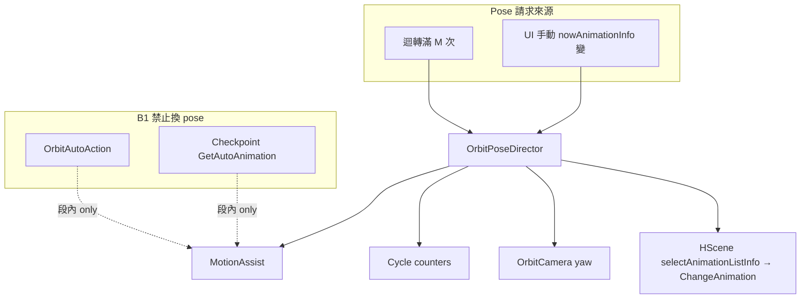
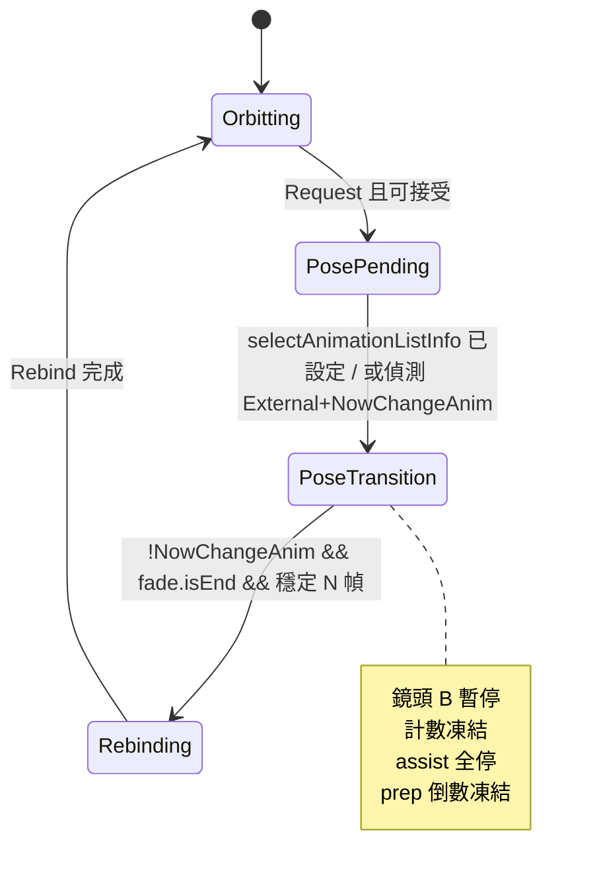

# OrbitPoseDirector 實作計畫

> **狀態**：規格已定、尚未實作  
> **前置 commit**：`ca231cd`（換姿卡住／狂換修復 — 保留，實作時整合重構）  
> **明確不做**：`OrbitSceneBinder` 換女主角（已 revert，不在本計畫範圍）

---

## 1. 問題與目標

### 現象

- 環視開著時，**換姿勢**有時卡死不再換，有時幾秒就換一次。
- **換姿過場**（`ChangeAnimation` + fade + 語音等待）期間，鏡頭、計數、視角重套、auto 協助行為不一致。

### 根因（摘要）

- 換 pose 有 **三條分散路徑**（迴轉 Cycle、auto 協助、卡關跳關），缺少單一協調者。
- 過場中僅 `TryQueueCyclePoseChange` 檢查 `NowChangeAnim`；**鏡頭仍寫 yaw、計數仍跑、`ApplyCurrentViewOption` 可能與遊戲搶相機**。
- `ShouldSuppressAssist` **不**感知 `NowChangeAnim`。

### 目標

- **B1**：換 pose 僅 **迴轉 Cycle + UI 手動**；auto/checkpoint **只推段內**，不換 `AnimationListInfo`。
- **過場 B**：`NowChangeAnim`（+ fade）期間 **暫停鏡頭**、**凍結迴轉計數**、**停 assist**、**延後 Rebind**。
- **程式乾淨**：唯一出口 `OrbitPoseDirector`；其他模組只讀 `IsTransitionActive` / `RequestPoseChange`。

---

## 2. 已定產品決策

| # | 決策 |
|---|------|
| 1 | 換姿 fade／過場期間 **鏡頭暫停（B）** |
| 2 | **B1**：auto/checkpoint 不換 pose |
| 3 | 過場期間 **凍結** `_rotationCount` / `_roundTripCount` / `_orbitAccumulatedDegrees` |
| 4 | UI 手動換姿走 **同一套 Transition**；不 reset 計數、不觸發準備倒數 |
| 5 | **準備倒數 3s** 僅在 `Ctrl+Shift+O` 開環視且 Idle；過場中 **暫停** 倒數時鐘 |
| 6 | 不實作換女主角（instance swap）邏輯 |

---

## 3. 架構



### 新檔

| 檔案 | 職責 |
|------|------|
| `OrbitPoseDirector.cs` | 狀態機、請求佇列、Transition 偵測、Rebind 觸發 |
| `docs/OrbitPoseDirector_實作計畫.md` | 本文件 |

### 修改檔（預估）

| 檔案 | 變更 |
|------|------|
| `OrbitController.cs` | 鏡頭積分改問 Director；移除直接 `ApplyCurrentViewOption` on pose 變更；Rebind 委派 Director |
| `OrbitCycleCoordinator.cs` | `ApplyPoseIfNeeded` → `Director.Request(Cycle)`；刪除直接 `TryQueueCyclePoseChange` |
| `OrbitBehaviorHub.cs` | B1：auto/checkpoint 不呼叫 `GetAutoAnimation` 換 pose；`ShouldSuppress` 或 defer 改問 Director；整合 pending/stale（或移入 Director） |
| `OrbitHudSnapshot.cs` / `OrbitStatusHud.cs` | 過場文案：「鏡頭暫停（換姿勢中）」 |
| `ORBIT_BEHAVIOR_AND_ARCHITECTURE.md` | 更新 §1 回程 yaw（已修正）與 Director 說明（可選） |

---

## 4. 狀態機



### 狀態說明

| 狀態 | 進入 | 離開 |
|------|------|------|
| **Orbitting** | 預設 | `RequestPoseChange` 成功排隊 |
| **PosePending** | suppress/busy 時 request 失敗 | 下一幀 retry 或進 Transition |
| **PoseTransition** | queue 成功或 External 偵測到換姿 | 遊戲過場結束 |
| **Rebinding** | 過場結束 | `ApplyCurrentViewOption` + `_startOrbitY` 同步完成 |

### 過場結束條件（與遊戲對齊）

參考 `HScene`：`selectAnimationListInfo == null && NowChangeAnim && fade.isEnd` → `nowChangeAnim = false`。

Director 離開 Transition 條件：

1. `!hScene.NowChangeAnim`
2. `fade.isEnd`（需反射或 Traverse 取 `hScene.fade`）
3. `chaFemales[0].animBody` 與 `cameraCtrl.transBase` 可用
4. 連續 **3 幀** 滿足（`StableReadyFramesRequired = 3`）

### Rebind 步驟（Rebinding 內一次完成）

1. 若 `_currentViewOption > maxFocus` → clamp
2. `ApplyCurrentViewOption(hScene, ctrl)`
3. `_startOrbitY` ← 當前 `CamDat.Rot.y`（**在 Apply 之後**）
4. `_lastNowAnimationInfoRef` ← `nowAnimationInfo`
5. **不**改 `_roundTripCount` / `_rotationCount`

---

## 5. API 草案

```csharp
internal enum PoseChangeSource { Cycle, External }

internal static class OrbitPoseDirector
{
    internal static bool IsTransitionActive { get; }
    internal static bool IsCameraPaused { get; }      // Transition + Rebinding
    internal static bool ShouldFreezeCycleCounters { get; }

    internal static void Reset();                     // 環視關閉
    internal static void Tick(HScene hScene, OrbitController orbit, CameraControl_Ver2 ctrl);

    internal static bool RequestPoseChange(HScene hScene, PoseChangeSource source, HScene.AnimationListInfo? explicitNext = null);
    internal static void NotifyExternalPoseChange(HScene hScene);  // nowAnimationInfo 變且非 Director 觸發
}
```

---

## 6. B1：auto / checkpoint 行為變更

### 現在

- `TryPushOrbitAutoActionAssist` → `isAutoActionChange` → 遊戲 `GetAutoAnimation` → 可能換 pose。
- `TickOrbitCheckpointAssist` → 直接 `GetAutoAnimation`。

### 目標

| 元件 | 新行為 |
|------|--------|
| `TryPushOrbitAutoActionAssist` | 保留推 `speed` / 段內旗標（若仍需要）；**移除**或 gating 掉會導致 `GetAutoAnimation` 換 pose 的路徑 |
| `TickOrbitCheckpointAssist` | Idle 卡關時只 **bump speed** 或 **假滾輪**（現有 fallback）；**不** invoke `GetAutoAnimation` |
| `OrbitBypassWheelPatches` | 保留（段內離開 Idle 用） |

> **注意**：需實機確認「只推 speed 不 GetAutoAnimation」是否足以解卡住；若不足，checkpoint 可改為「僅在 `IsTransitionActive==false` 且非 Idle 時」的較窄 fallback，仍不換 pose。

---

## 7. 與 ca231cd 的整合

| ca231cd 已有 | 處置 |
|--------------|------|
| `TryQueueCyclePoseChange` / `selectAnimationListInfo` | 移入 `Director.Request` |
| `MarkPendingCyclePoseChange` / Retry | 移入 Director pending 佇列 |
| `NotifyCyclePoseChangeQueued` + 15s quiet | **刪除** quiet；Transition 已 block assist |
| `TickStaleSelectionRecovery` | 保留於 Hub 或移入 Director recovery |
| `PickNextPose` by id | 保留，Director 呼叫 |

---

## 8. OrbitController 整合要點

### LateUpdate 順序（概念）

1. `OrbitPoseDirector.Tick(...)` — 更新狀態、可能 Rebind
2. 若 `!Director.IsCameraPaused` → 積分 yaw、邊界觸發 Cycle 副作用（**換 pose 改為 Request**）
3. 若 `Director.ShouldFreezeCycleCounters` → 跳過積分與 `_rotationCount++`
4. 仍寫 `ctrl.Rot`（暫停時維持 `_startOrbitY + _orbitAccumulatedDegrees` 不變）
5. **移除**「`nowAnimationInfo` 變 → 立即 `ApplyCurrentViewOption`」；改 `Director.NotifyExternalPoseChange`

### 準備倒數

- `_waitingForPrepStart` 只在 `OnOrbitToggled(true) && IsInPreparationState`
- `Director.IsTransitionActive` 時不遞減 prep 計時（凍結 `PrepRemainSeconds`）

---

## 9. HUD

| 條件 | 文案 |
|------|------|
| `Director.IsCameraPaused` | `環視中 · 鏡頭暫停（換姿勢中）` |
| assist | `自動操作：換姿過渡，已暫停` |
| 正常 | 維持現有去程／回程估算 |

---

## 10. 實作步驟（建議順序）

### Phase A — 骨架（可編譯、行為近似現況）

1. 新增 `OrbitPoseDirector.cs`：狀態 enum、`Tick` 空殼、`IsTransitionActive` 恆 false
2. `OrbitController` 呼叫 `Tick`；加 `IsCameraPaused` 閘門（暫停積分）
3. 編譯部署 smoke test

### Phase B — Transition 偵測 + Rebind

4. 實作 `PoseTransition` / `Rebinding` 偵測（`NowChangeAnim` + `fade.isEnd`）
5. 實作 Rebind（Apply + `_startOrbitY`）
6. External：`NotifyExternalPoseChange` 取代直接 `ApplyCurrentViewOption`
7. HUD 文案

### Phase C — 唯一換 pose 出口

8. `OrbitCycleCoordinator.ApplyPoseIfNeeded` → `Director.Request(Cycle)`
9. 移除 Coordinator 內直接 queue 邏輯

### Phase D — B1 auto/checkpoint

10. 改 `TryPushOrbitAutoActionAssist` / `TickOrbitCheckpointAssist`（不 GetAutoAnimation 換 pose）
11. 刪除 cycle quiet 15s；pending 併入 Director
12. 實機：Idle 卡關、WLoop 段內推進仍正常

### Phase E — 清理

13. 更新 CHANGELOG / 架構 doc
14. 確認設定說明：換 pose 僅 Cycle + UI；auto 只推段內

---

## 11. 測試清單

| # | 情境 | 預期 |
|---|------|------|
| T1 | 開 `ChangePoseOnCycle`，M=2，等 2 迴轉 | 換 pose 一次；過場中鏡頭停、HUD 顯示換姿中 |
| T2 | 過場中剛好滿 M 迴轉 | pending，過場後再換，不雙重 ChangeAnimation |
| T3 | UI 手動換姿 | 同 T1 過場行為；計數不 reset |
| T4 | 長語音 pose（CheckSpeek 久） | `NowChangeAnim` 期間 assist 不推、鏡頭停 |
| T5 | `OrbitAutoActionEnabled` on，checkpoint=5 | **不**數秒換 pose；段內仍可動 |
| T6 | 開環視 Idle 準備倒數 + 中途 UI 換姿 | prep 凍結；換姿結束後 prep 繼續（或 spec 改為換姿取消 prep — 實作時二選一寫死） |
| T7 | 關環視再開 | Director Reset；prep 僅開環視時觸發 |

**T6 待實作時二選一**（建議 **prep 凍結後繼續**，不取消）：

- A：換姿過場 **凍結** prep，結束後繼續倒數  
- B：換姿 **取消** prep（已非純 Idle 開場）

---

## 12. 風險與緩解

| 風險 | 緩解 |
|------|------|
| B1 後 Idle 真的卡死 | checkpoint 保留 speed bump / wheel bypass；必要時窄範圍 GetAutoAnimation（仍不換 pose） |
| `fade` 欄位非 public | `Traverse.Create(hScene).Field("fade")` |
| External 與 Cycle 雙觸發 | Director 記 `_lastRequestedInfoId`；Transition 中 ignore 新 Request |
| 與 ca231cd stale recovery 重複 | 合併進 Director 單一 recovery |

---

## 13. 不在範圍

- 換女主角（`GetInstanceID`）
- 改 Q/W/E 焦點熱鍵
- 興奮劑 / FeelHit patches
- `unscaledDeltaTime` 驅動環視（可另開 issue；本計畫過場 B 已暫停積分）

---

## 14. 參考

- `OrbitCycleCoordinator.cs`（ca231cd）
- `OrbitBehaviorHub.cs`（suppress、assist、stale）
- `dll_decompiled/HScene.cs`：`ChangeAnimation`、`NowChangeAnim`、`CheckSpeek`、fade
- 討論摘要：B1 + 過場 B + 計數凍結 + UI 同套 Transition
